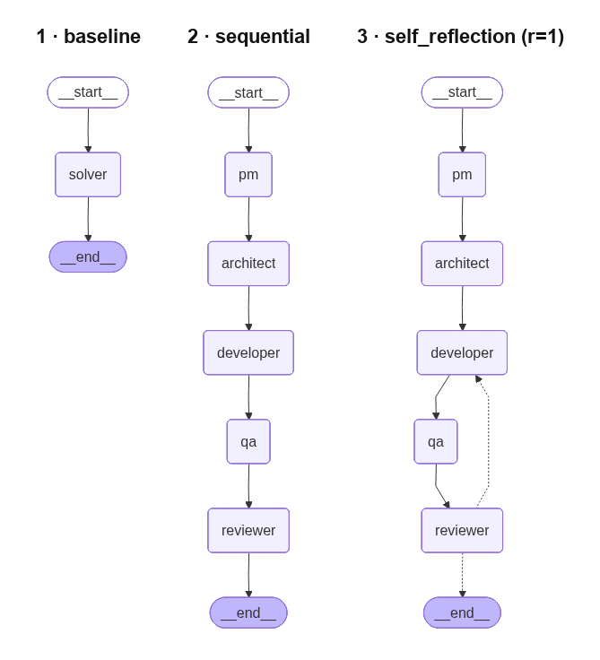

# Orquestación de Equipos de Agentes LLM para Generación Automática de Código

> Trabajo Fin de Grado · Grado en Computación e IA · Universidad Alfonso X el Sabio · 2025–2026


[](entrega/2526_TFG_GCIA_NP147254_Memoria.pdf)

---

## El problema

Se ha vuelto intuición de moda en la industria que descomponer una tarea de programación entre varios agentes LLM especializados —un Product Manager, un Arquitecto, un Developer, un Tester, un Reviewer— produce mejor código que un único modelo resolviéndola de golpe, y sobre esa premisa se están construyendo frameworks multi-agente enteros. Este TFG la somete a un **experimento controlado** sobre HumanEval midiendo no solo la corrección (pass@1) sino el **coste real** en tokens y latencia. El resultado importa porque es contraintuitivo: con un modelo de 7B servido en local, la orquestación multi-agente **no mejora la corrección —la empeora— y cuesta ≈40× más tokens y ≈77× más latencia**. La complejidad arquitectónica que muchos equipos están adoptando puede salir muy cara sin aportar calidad.

---

## Resultados

492 ejecuciones por configuración sobre HumanEval (164 problemas × 3 semillas), Qwen 2.5 Coder 7B `Q4_K_M` en local:

| Configuración | pass@1 | IC 95 % | Tokens medios | Latencia (s) |
|---|---:|:--:|---:|---:|
| **1 · Baseline** | **80,08 %** | [76,42 ; 83,54] | **283** | **5,1** |
| 2 · Sequential | 58,33 % | [53,86 ; 62,60] | 11 614 | 396,4 |
| 3 · Self-reflection (r=1) | 64,84 % | [60,57 ; 69,31] | 14 135 | 411,6 |

McNemar pareado: Baseline vs Sequential y Baseline vs SR(r=1) con *p* < 0,0001. La frontera de Pareto coste-calidad la ocupa por completo el baseline.

---

## Las tres configuraciones



1. **Baseline** — un único nodo: una llamada al LLM produce el código final.
2. **Sequential** — pipeline de cinco roles (PM → Arquitecto → Developer → QA → Reviewer) con estado compartido tipado y comunicación por artefactos.
3. **Self-reflection** — el pipeline secuencial con un bucle iterativo Reviewer → Developer (`max_revisions = 1` en la corrida principal).

---

## Key engineering decisions

- **Shared state**: `AgentState` (TypedDict) flows through every LangGraph node; token counts and latency accumulate in-place so telemetry is always available at graph exit.
- **Sandbox isolation**: generated code runs in a subprocess (not `exec` in the main process) with builtins restricted to prevent filesystem/network side-effects.
- **Reproducibility**: every evaluation run is seeded with `random.seed(seed)` before graph invocation; seeds are logged in the output CSV.
- **pass@k estimator**: uses the unbiased formula from Chen et al. (2021), computed in log-space to avoid overflow for large n.
- **QA agent**: deterministic — runs the sandbox, never calls the LLM, so it adds zero token cost and is fast.
- **Reviewer verdict**: derived deterministically from `test_results` (APPROVE iff every per-test entry passes); the LLM only produces qualitative commentary (issues + suggested fixes). The verdict line is prepended to `state["review_comments"]` so the `self_reflection` router sees a stable first-line format.
- **HumanEval prompt prepending**: before sandbox execution, the original problem prompt (which contains the imports and signature context) is concatenated to the generated `code_artifact`, replicating the canonical `prompt + completion` evaluation pattern from Chen et al. (2021, §2.2).

---

## Reproducir

Requiere [Ollama](https://ollama.com) en local.

```bash
# 1. Entorno + modelo
pip install -e ".[experiments]" && ollama pull qwen2.5-coder:7b-instruct-q4_K_M

# 2. Smoke test (~15 min, 10 problemas × 5 configs)
python experiments/quick_check.py

# 3. Corrida canónica del TFG (resumible: re-ejecutar omite lo ya hecho)
LLM_BACKEND=ollama python experiments/run_experiments.py \
    --model qwen2.5-coder:7b-instruct-q4_K_M --benchmarks humaneval \
    --configs baseline,sequential,self_reflection_r1
```

El análisis (figuras + tablas con IC bootstrap y contrastes de McNemar) se regenera con `python experiments/analyze_results.py`.

---

## Documentación

- [📄 **Memoria completa (PDF)**](entrega/2526_TFG_GCIA_NP147254_Memoria.pdf) — documento final del TFG (115 págs.).
- [Capítulos de la memoria](doc/capitulos/) — del resumen a la reflexión final.
- [Anexo de decisiones técnicas](doc/decisiones.md) — sprint a sprint, con alternativas evaluadas y descartadas.
- [Bibliografía global](doc/referencias/bibliografia.md) (BibTeX en `referencias.bib`).

## Licencia

MIT. Véase `LICENSE`.
